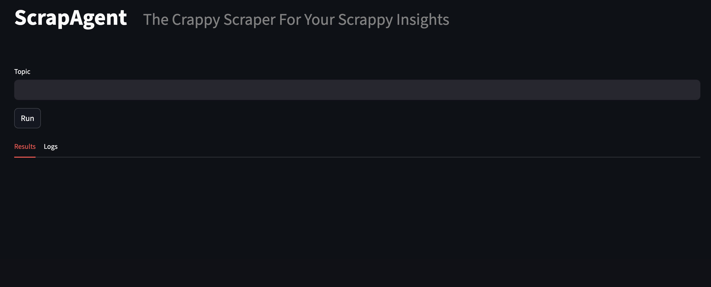

# ScrapAgent – Autonomous Research Agent

**Demo-ready** project that searches the web, clusters content with embeddings, and writes an executive brief with sources and trend scores.

## Quickstart
1. Python 3.10+ recommended
2. `python -m venv .venv && source .venv/bin/activate` (Windows: `venv\Scripts\activate`)
3. `pip install -r requirements.txt`
4. Copy `.env.example` to `.env` and add your API keys:
   - `OPENAI_API_KEY` (Azure/OpenAI)
   - `HF_API_KEY` (Hugging Face embeddings)
   - `GOOGLE_API_KEY` and `GOOGLE_CSE_ID` (for Google Custom Search)
5. `streamlit run app.py`

## How it works
- **Search**: Google Custom Search API via `WebSearchTool`  
- **Scrape**: Optional content fetch from URLs via `ScrapeUrlsTool` (initiated by the model)
- **Embeddings**: Azure OpenAI `text-embedding-3-small`
- **Clustering**: HDBSCAN over normalized vectors
- **Summaries**: GPT-5-MINI per cluster; final brief with GPT-5

## Tips
- Keep topics specific: e.g., `"electric bikes this week"` vs. `"bikes"`
- For a reliable demo, run with 10–20 items; adjust `min_cluster_size` in `agent/loop.py`
- Extend sources by adding RSS or site-specific scrapers to `tools/`
- Expect clustering results to vary slightly between DDGS and Google CSE due to different search results

## Safety & Respect
Use responsibly, comply with each site’s Terms of Service and robots.txt. For production, add caching and rate limiting.

## Screenshots

### Design

### Home Page - Enter Your Prompt

### Agent Logs - See the Process

### View Research Brief

### See Themes in Depth

### View Charts

#### Cluster Graph Legend

